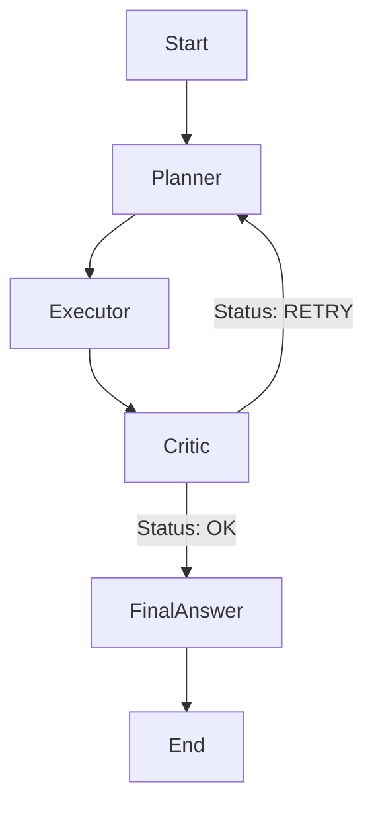

# Agentic RAG System
An Agentic Retrieval-Augmented Generation (RAG) system that uses a multi-step reasoning pipeline:  Planner → Tool Use → Critic (Retry Loop) → Final Answer 

Built with LangGraph, LangChain, FAISS, Ollama, and Streamlit, this app lets you upload documents (PDF/TXT), build a vector index, and ask questions with verifiable, citation-backed answers.

## Key Features

* **Agentic Architecture:** Uses [LangGraph](https://langchain-ai.github.io/langgraph/) to orchestrate a loop between a Planner, Tool Executor, and Critic.
* **Self-Correction:** A "Critic" node evaluates retrieved evidence. If the evidence is insufficient, the system triggers a retry loop with new, targeted search queries.
* **ReAct Loop:** The Executor uses a reasoning loop to decide if it needs to call tools multiple times to answer a single sub-question.
* **Citation Awareness:** Answers include inline citations `[Source, p. X]` that map directly to the retrieved chunks.
* **Robust Ingestion:** Handles PDF/TXT files with SHA-256 deduplication and per-file error handling.
* **Security:** Includes a "Safe Mode" for FAISS vector store loading to prevent deserialization attacks.

## Architecture




### 1. Final Project Structure

Organize your folder like this. You likely already have the Python files, but you need to add the files marked with `+`.

```text
agentic-rag/
├── app.py
├── agent.py
├── config.py
├── ingestion.py
├── logging_config.py
├── tools.py
├── vectorstore.py
├── .gitignore             (+)
├── README.md              (+)
├── requirements.txt       (+)
└── LICENSE                (+)

```

---

### 2. Create the `requirements.txt`

This allows others to install the necessary libraries easily. Based on your imports, create a file named `requirements.txt` with this content:

```text
streamlit
langchain
langchain-core
langchain-community
langchain-ollama
langchain-text-splitters
langgraph
faiss-cpu
pypdf

```

### 3. Create the `.gitignore`

You must prevent temporary files, logs, and large vector databases from being uploaded. Create a file named `.gitignore` (note the dot at the start) with this content:

```text
# Python junk
__pycache__/
*.pyc

# Data & Logs (Don't upload the vector DB or runtime logs)
data/
logs/
doc_fingerprints.json
ingest_manifest.json

# Environment
.venv/
venv/
.env

```

### 4. Create a Professional `README.md`

This is your "sales pitch." Copy this template and save it as `README.md`. It highlights the advanced features (Agentic loop, ReAct, Critic) which makes you look much better than someone who just built a basic "Chat with PDF" wrapper.

```markdown
# 🕵️ Local Agentic RAG with Ollama

A robust, agentic Retrieval-Augmented Generation (RAG) system that runs entirely locally. unlike standard RAG pipelines, this system uses a **Planner-Executor-Critic** architecture to iteratively refine search queries, verify evidence, and ensure answers are strictly grounded in the provided documents.

## 🌟 Key Features

* **Agentic Architecture:** Uses [LangGraph](https://langchain-ai.github.io/langgraph/) to orchestrate a loop between a Planner, Tool Executor, and Critic.
* **Self-Correction:** A "Critic" node evaluates retrieved evidence. If the evidence is insufficient, the system triggers a retry loop with new, targeted search queries.
* **ReAct Loop:** The Executor uses a reasoning loop to decide if it needs to call tools multiple times to answer a single sub-question.
* **Citation Awareness:** Answers include inline citations `[Source, p. X]` that map directly to the retrieved chunks.
* **Robust Ingestion:** Handles PDF/TXT files with SHA-256 deduplication and per-file error handling.
* **Security:** Includes a "Safe Mode" for FAISS vector store loading to prevent deserialization attacks.

## 🛠️ Architecture


## Getting Started

### Prerequisites

1. **Python 3.9+**
2. **[Ollama](https://ollama.com/)** installed and running.
* Pull the models used in the config (these are the base models I used, but you can try other models for the embedding and generation process):
```bash
ollama pull llama3.1
ollama pull nomic-embed-text

```


### Installation

1. Clone the repository:
```bash
git clone [https://github.com/YOUR_USERNAME/agentic-rag.git](https://github.com/YOUR_USERNAME/agentic-rag.git)
cd agentic-rag

```


2. Install dependencies:
```bash
pip install -r requirements.txt

```


3. Run the application:
```bash
streamlit run app.py

```


## Usage

1. **Upload Documents:** Use the sidebar to upload PDF or TXT files.
2. **Ingest:** Click "Ingest" to process files and build the FAISS vector index. (If you already ingested files previously, you can click on "Load" to load those vector indices without needing to ingest again)
4. **Chat:** Ask complex questions. The Agent will:
* Break the question down into a plan.
* Search specifically for each part of the plan.
* Critique its own findings and retry if necessary.
* Provide a final answer with sources.


## Security Note

This app includes a security toggle for **FAISS Deserialization**. By default, loading pickle-based indexes is disabled for safety. If you are loading an index you created locally, enable "Allow Dangerous Deserialization" in the sidebar.

```
